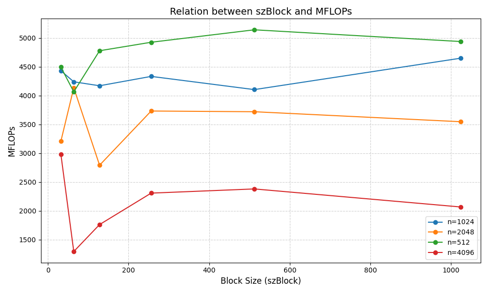

# TD1

`pandoc -s --toc README.md --css=./github-pandoc.css -o README.html`

## lscpu

*lscpu donne des infos utiles sur le processeur : nb core, taille de cache :*

```
$ grep 'cpu cores' /proc/cpuinfo |uniq
cpu cores       : 8
$ grep 'cache size' /proc/cpuinfo |uniq
cache size      : 18432 KB
$ wmic cpu get Name, NumberOfCores, NumberOfLogicalProcessors, L2CacheSize, L3CacheSize

```
L2CacheSize | L3CacheSize | Name                                |   NumberOfCores | NumberOfLogicalProcessors
------------|-------------|-------------------------------------|-----------------|---------------------------
9216        | 18432       | 12th Gen Intel(R) Core(TM) i7-1260P |  12             |16


## Partie 1: Produit matrice-matrice

### Effet de la taille de la matrice

  n            | MFlops
---------------|--------
1024 (origine) | 340.291
1023           | 899.395
1025           | 504.136

*Expliquer les résultats.*


1024 est une puissance de 2 et peut provoquer des conflits de cache;

Limitations SIMD: 1023 et 1025 permettent une meilleure adaptation des blocs SIMD, notamment avec des stratégies d’optimisation comme le prefetching et le loop unrolling.


### Permutation des boucles

*Expliquer comment est compilé le code (ligne de make ou de gcc) : on aura besoin de savoir l'optim, les paramètres, etc. Par exemple :*

`make TestProduct.exe && ./TestProduct.exe 1024`


  ordre           | time    | MFlops  | MFlops(n=2048)
------------------|---------|---------|----------------
i,j,k (origine)   | 2.73764 | 782.476 | 240.485
j,i,k             | 2.451   | 876.167 | 148.043
i,k,j             | 6.279   | 341.989 | 150.247
k,i,j             | 5.9599  | 360.219 | 128.833
j,k,i             | 0.4872  | 4407.07 | 3369.76
k,j,i             | 0.5237  | 4100.02 | 2665.43


*Discuter les résultats.*


Les ordres jki et kji sont plus rapides, et les raisons sont les suivantes :

Optimisation du modèle d’accès au cache, évitant les cache misses présents dans l’ordre ijk.

Les accès à B et C deviennent plus continus, réduisant ainsi le nombre de chargements de données depuis la mémoire par le CPU.

Un taux de cache hit plus élevé (Cache Hit Rate) entraîne une amélioration des performances, augmentant les MFLOPs à plus de 3000, alors que l’ordre ijk atteint seulement environ 1000.


### OMP sur la meilleure boucle

`make TestProduct.exe && OMP_NUM_THREADS=8 ./TestProduct.exe 1024`

  OMP_NUM         | MFlops  | MFlops(n=2048) | MFlops(n=512)  | MFlops(n=4096)
------------------|---------|----------------|----------------|---------------
1                 | 4206.25 | 4230.14        | 4361.62        | 2298.66
2                 | 8544.66 | 5153.08        | 8284.94        | 4051.23
3                 | 12757.3 | 7831.96        | 12296.7        | 6645.5
4                 | 14708.3 | 9032.61        | 16777          | 9380.09
5                 | 12198.4 | 9883.64        | 14747.7        | 9316.13
6                 | 15573.2 | 12032.2        | 15323.6        | 5164.32
7                 | 16701.5 | 13561.3        | 15755.3        | 4244.2
8                 | 19555   | 14881.2        | 16729.5        | 10794.5

*Tracer les courbes de speedup (pour chaque valeur de n), discuter les résultats.*


Pour les matrices de petite taille (par exemple n=512 et n=1024), l'augmentation du nombre de threads améliore initialement les performances, mais à un nombre élevé de threads, la croissance ralentit, voire diminue. Cela pourrait être dû à l'augmentation des **coûts de communication** et **de synchronisation entre les threads**. Les performances des matrices de petite taille sont fortement affectées par la synchronisation des threads, ce qui réduit l'efficacité à un nombre élevé de threads.

Pour les matrices de grande taille (par exemple n=2048 et n=4096), l'efficacité du multithreading est plus notable, en particulier avec 3 à 4 threads, où l'accélération (Speedup) est **presque linéaire**. Pour les grandes matrices (n=4096), les ruptures et fluctuations dans la courbe de Speedup peuvent être dues à des limitations de bande passante mémoire ou à une diminution de l'utilisation efficace des caches.

En conclusion,le multithreading est plus efficace pour les grandes matrices.
Le nombre optimal de threads doit être choisi en fonction de la taille de la matrice, car un nombre excessif de threads peut entraîner des coûts supplémentaires et une diminution des performances.


### Produit par blocs

`make TestProduct.exe && ./TestProduct.exe 1024`

  szBlock         | MFlops  | MFlops(n=2048) | MFlops(n=512)  | MFlops(n=4096)
------------------|---------|----------------|----------------|---------------
origine (=max)    | 4620.22 | 2840.5         | 5603.37        | 2369.38
32                | 4430.47 | 3207.29        | 4492.97        | 2982.27
64                | 4237.79 | 4133.57        | 4064.41        | 1294.54
128               | 4169.28 | 2791.32        | 4776.58        | 1761.58
256               | 4331.79 | 3731.22        | 4923.96        | 2307.21
512               | 4102.66 | 3718.89        | 5139.83        | 2379.74
1024              | 4647.44 | 3545.66        | 4936.51        | 2066.93

*Discuter les résultats.*



En général, le choix de la taille des blocs influence considérablement les performances, car il affecte la localité mémoire et l'utilisation du cache.

D'après les résultats observés dans le graphique :

Les différentes dimensions des matrices (n) ont des impacts variés sur les performances.

Pour certaines dimensions (par exemple, n=1024 et n=2048), une taille de bloc (szBlock) plus grande peut améliorer les performances.

Dans d'autres cas (comme n=4096), augmenter la taille de szBlock peut entraîner une diminution des performances.

### Bloc + OMP


  szBlock      | OMP_NUM | MFlops  | MFlops(n=2048) | MFlops(n=512)  | MFlops(n=4096)|
---------------|---------|---------|----------------|----------------|---------------|
1024           |  1      | 4633.68 | 3402.95        | 5118.14        | 2591.37       |
1024           |  8      | 4580.94 | 11272.1        | 5033.77        | 12226.9       |
512            |  1      | 4717.66 | 4400.86        | 4846.87        | 2267.74       |
512            |  8      | 13317.1 | 17138          | 4554.21        | 14247.2      |

*Discuter les résultats.*


Les performances multithread sont nettement supérieures à celles à un seul thread, grâce à **l'accélération due au calcul parallèle**.
Lorsque szBlock=512, les performances sont considérablement meilleures que pour szBlock=1024, en particulier pour des dimensions de matrice moyennes (par exemple, n=2048), où les performances atteignent un pic. Cela montre que les **petites tailles de bloc** sont plus efficaces dans l'optimisation parallèle.
Pour des dimensions de matrice plus grandes (par exemple, n=4096), les performances diminuent en raison des contraintes de communication entre threads et de bande passante mémoire.

En résumé, les petites tailles de bloc (szBlock=512) montrent les meilleures performances en cas de calcul multithread, en particulier pour les dimensions de matrice moyennes. Bien que les grandes tailles de bloc (szBlock=1024) soient relativement stables en mode mono-thread, elles ne tirent pas pleinement parti de l'optimisation parallèle.


### Comparaison avec BLAS, Eigen et numpy

*Comparer les performances avec un calcul similaire utilisant les bibliothèques d'algèbre linéaire BLAS, Eigen et/ou numpy.*

bibliothèque | MFlops(n=1024)
-------------|--------
BLAS         | 150571
Eigen        | 21536.8S

Ces bibliothèques utilisent généralement la technique de décomposition en blocs (Blocking) pour diviser les opérations, telles que la multiplication de matrices, en blocs afin de maximiser l'utilisation du cache. Par rapport à une implémentation manuelle, BLAS et Eigen choisissent une taille de bloc optimale adaptée au matériel spécifique, ce qui augmente le taux de réussite dans le cache.  

Eigen utilise une technologie avancée de vectorisation (Vectorization) en exploitant les jeux d'instructions SIMD (Single Instruction, Multiple Data) du processeur (tels que AVX, AVX-512) pour traiter les données en parallèle. En outre, ces bibliothèques sont optimisées pour les caractéristiques des architectures de processeurs spécifiques (comme Intel ou AMD), notamment la taille du cache, le pipeline et l'utilisation de la bande passante mémoire.

## Circulation d’un jeton dans un anneau

# Tips

```
	env
	OMP_NUM_THREADS=4 ./produitMatriceMatrice.exe
```

```
    $ for i in $(seq 1 4); do elap=$(OMP_NUM_THREADS=$i ./TestProductOmp.exe|grep "Temps CPU"|cut -d " " -f 7); echo -e "$i\t$elap"; done > timers.out

```

## Partie 2
### Circulation d’un jeton dans un anneau

`mpicc test_anneau.c -o test_anneau`
`mpiexec -n 8 test_anneau`


### Calcul très approché de pi
#### OpenMP

`g++ -fopenmp -o OpenMP_pi OpenMP_pi.cpp `

Nombre de Thread  |   1   |    2   |   3   |    4   |   5   |   6   |   7   |   8   |
------------------|-------|--------|-------|-------|-------|-------|-------|-------|
Temp de calcul(s) |40.451 | 22.871 |17.545 |12.536 |14.83  |13.397 |11.069 | 9.899 |
L'accélération    |1      | 1.769  |2.306  |3.227  |2.728  |3.019  |3.654  | 4.086 |


#### MPI

`mpicxx -o calcul_pi calcul_pi.cpp`

Nombre de Processus  |   1   |    2   |   3   |   4   |   5   |   6   |   7   |   8   |
---------------------|-------|--------|-------|-------|-------|-------|-------|-------|
Temp de calcul(s)    |3.868  | 1.214  |0.926  |0.682  |0.586  |0.667  |0.632  | 0.503 |
L'accélération       |1      | 3.19   |4.18   |5.67   |6.600  |5.80   |6.12   |7.69   |

#### Python

`mpiexec  -n 4 path\python_which_include_numpy compute_pi.py`

Nombre de Processus  |   1   |    2   |   3   |   4   |   5   |   6   |   7   |   8   |
---------------------|-------|--------|-------|-------|-------|-------|-------|-------|
Temp de calcul(s)    |1.3266 | 1.0436 |0.7792 |0.609  |0.5279 |0.4448 |0.3943 |0.3728 |
L'accélération       |1      | 1.271  |1.7025 |2.178  |2.507  |2.976  |3.367  |3.558  |


### diffusion d’un entier dans un réseau hypercube

`mpicc -o diffusion_cube diffusion_cube.c`


La principale raison pour laquelle la sortie est dans le désordre est que l'exécution de programmes parallèles est de nature **asynchrone**, en particulier lors de l'utilisation de MPI pour la communication distribuée, où chaque tâche (ou processus) s'exécute indépendamment.

# Questions Rencontrées

**Petite Question pour info : le nombre de coeurs est différent selons les commandes ?**

**ET : lscpu ne marche pas pour MSYS2 ou Windows ?**
